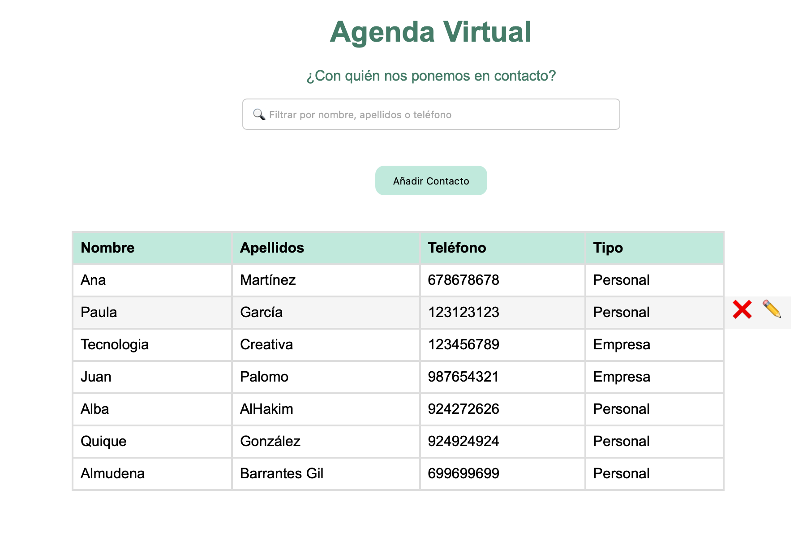
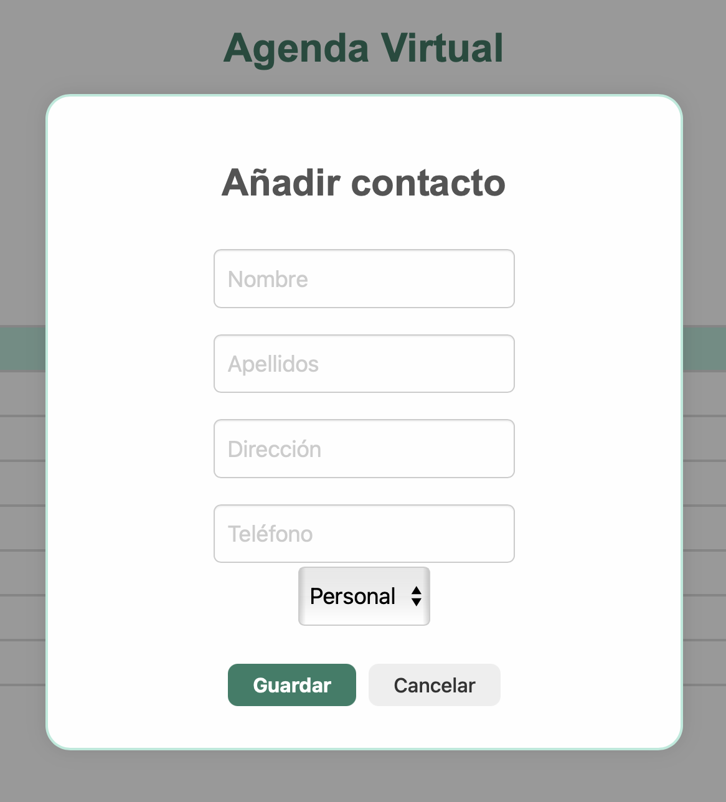

# 📇 Agenda Virtual · Proyecto Fullstack

Gestor de contactos web desarrollado con Node.js, Express y MySQL.

---

## 🚀 ¿Qué es *Agenda Virtual*?

**Agenda Virtual** es una aplicación web fullstack que permite gestionar una lista de contactos personales de forma sencilla, intuitiva y eficiente.

Este proyecto nace como ejercicio de aprendizaje dentro de las prácticas del ciclo formativo de Desarrollo de Aplicaciones Web, con el objetivo de aplicar conocimientos de backend, frontend y bases de datos relacionales en un entorno real.

### 🎯 Objetivos:
- Desarrollar una aplicación funcional CRUD.
- Estructurar código de forma limpia, mantenible y escalable.
- Ofrecer una experiencia de usuario accesible y fluida.

---

## 🛠️ Tecnologías utilizadas

- **Backend:** Node.js, Express  
- **Base de datos:** MySQL  
- **Frontend:** HTML5, CSS3, JavaScript  
- **UX/UI:** SweetAlert2 para interacciones dinámicas  

---

## ✨ Características principales

- Interfaz amigable y limpia.
- Operaciones CRUD completas (crear, leer, actualizar, eliminar).
- Alertas interactivas con SweetAlert2.
- Validaciones básicas para evitar duplicados y errores.
- Filtrado por campos para búsquedas rápidas.
- Diseño adaptable (en proceso de mejora).
- Código modular y documentado.

---

## 🖼️ Imágenes

| Listado de contactos | Formulario de alta |
|----------------------|---------------------|
|  |  |

---

## 📘 Retos enfrentados y aprendizajes

Este proyecto ha supuesto un aprendizaje completo del desarrollo fullstack. Algunos de los principales retos han sido:

- Configuración de entorno y conexión de Express con MySQL desde cero.
- Comprender la estructura y lógica de las rutas backend.
- Aplicar validaciones básicas tanto en el servidor como en el cliente.
- Reforzar la lógica condicional y los flujos de control del frontend.
- Aprender a modularizar código para futuras ampliaciones.

Cada obstáculo ha sido una oportunidad para adquirir conocimientos prácticos valiosos.

---

## 🔮 Mejoras futuras y visión de evolución

Próximos pasos para seguir creciendo con este proyecto:

- Refactorización del código JavaScript.
- Incorporación de filtros dinámicos en tiempo real.
- Exportación de contactos (CSV o PDF).
- Ordenación avanzada por campos.
- Mejora de la accesibilidad (a11y).
- Ajustes UX/UI para mejorar la experiencia general.
- Publicación online con entorno de pruebas (Vercel / Render).

---

## 💻 Instalación local

1. Clona este repositorio: https://github.com/cintia-sd/agenda.git

2. Accede a la carpeta: cd agenda

3. Instala las dependencias: npm install
    
4. Crea una base de datos llamada `agenda` en tu servidor MySQL  
e importa el archivo `agenda.sql`.

5. Inicia el servidor: node index.js
 
6. Abre tu navegador en `http://localhost:3000`

---

## 📈 Estado del proyecto

Actualmente en desarrollo activo.  
En proceso de implementación de mejoras visuales, accesibilidad y funcionalidades avanzadas.

---

## 👩🏻‍💻 Autor

**Cintia Sánchez Díaz**  
Desarrolladora web en formación | Creativa, resolutiva y en constante evolución.  
📧 csanchezdiaz1988@gmail.com  
🔗 [LinkedIn](https://linkedin.com/in/sanchezdiazcintia)  
🔗 [GitHub](https://github.com/cintia-sd)

---

## 📬 Contacto profesional

¿Te interesa este proyecto o quieres colaborar conmigo?

No dudes en escribirme para propuestas laborales, sugerencias o cualquier consulta.

---

## 🪪 Licencia

Este proyecto está bajo la licencia MIT.  
Puedes usarlo, adaptarlo o mejorarlo libremente citando al autor.

---

